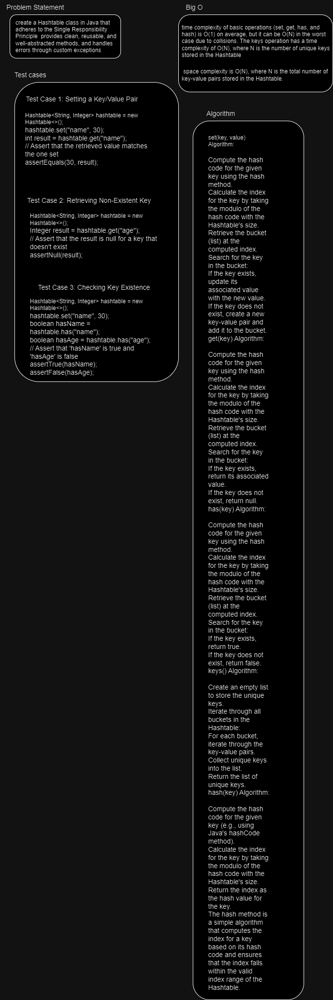
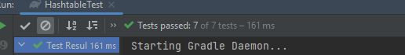
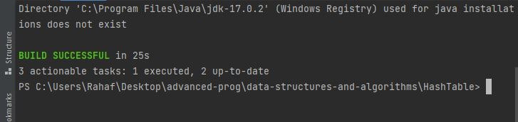

# Hash Table
create a Hashtable class in Java that adheres to the Single Responsibility Principle, provides clean, reusable, and well-abstracted methods, and handles errors through custom exceptions. The Hashtable class should support the following functionalities and be tested accordingly:

1. Setting a Key/Value Pair: The class should allow you to set a key-value pair in the data structure. If a key already exists, its value should be updated with the new value.

2. Retrieving a Value by Key: You should be able to retrieve a value based on a key. If the key exists in the Hashtable, it should return the associated value. If the key doesn't exist, it should return null.

3. Checking for Key Existence: You should be able to check if a key exists in the Hashtable. If the key exists, it should return true; otherwise, it should return false.

4. Listing Unique Keys: You should be able to retrieve a list of all unique keys that exist in the Hashtable.

5. Handling Collisions: The Hashtable should handle collisions correctly. If two keys hash to the same index, they should be stored in a bucket at that index, and you should still be able to retrieve values by key.

6. Hashing a Key to an In-Range Value: The Hashtable should hash a key to a value that is within the valid index range of the Hashtable.

## Whiteboard Process

## Approach & Efficiency

Data Structure: The core data structure for the Hashtable is an array of lists (buckets), where each list stores key-value pairs. The size of the array (the number of buckets) is typically chosen to be a prime number to reduce the chance of collisions.

Hashing Function: The Hashtable uses a hashing function to determine the index where each key-value pair should be stored. The hash function takes a key, computes its hash code, and then maps it to a valid index within the array by taking the modulo of the hash code with the array size. The goal is to evenly distribute keys across the array.

Collision Handling: Collisions occur when two or more keys hash to the same index. To handle collisions, each bucket (list) at an index may contain multiple key-value pairs. When adding a new key-value pair, the code checks if the key already exists in the bucket. If it does, the code updates the value for that key. If not, a new key-value pair is added to the bucket.

Basic Operations:

set(key, value): To set a key-value pair, the code computes the index using the hash function, retrieves the corresponding bucket, and either updates an existing key's value or adds a new key-value pair to the bucket.
get(key): To retrieve a value, the code calculates the index, searches the bucket for the key, and returns the associated value if found, or null if not.
has(key): To check for key existence, the code computes the index, searches the bucket, and returns true if the key is found, or false if not.
keys(): To list unique keys, the code iterates through all buckets, collects unique keys into a list, and returns the list.
Error Handling: The code includes error handling to ensure that keys are not null. If a null key is encountered, the code raises an IllegalArgumentException.

Private Inner Class: To encapsulate key-value pairs, a private inner class (Entry) is used to represent key-value pairs within the Hashtable.

Complexities:

The space complexity is O(N), where N is the total number of key-value pairs.
The time complexity for basic operations is typically O(1) on average but can degrade to O(N) in the worst case due to collisions.

## Solution
functional implementation of a Hashtable class in Java. It uses an array of lists to handle collisions, and it includes the required methods (set, get, has, keys) as well as the hash function

