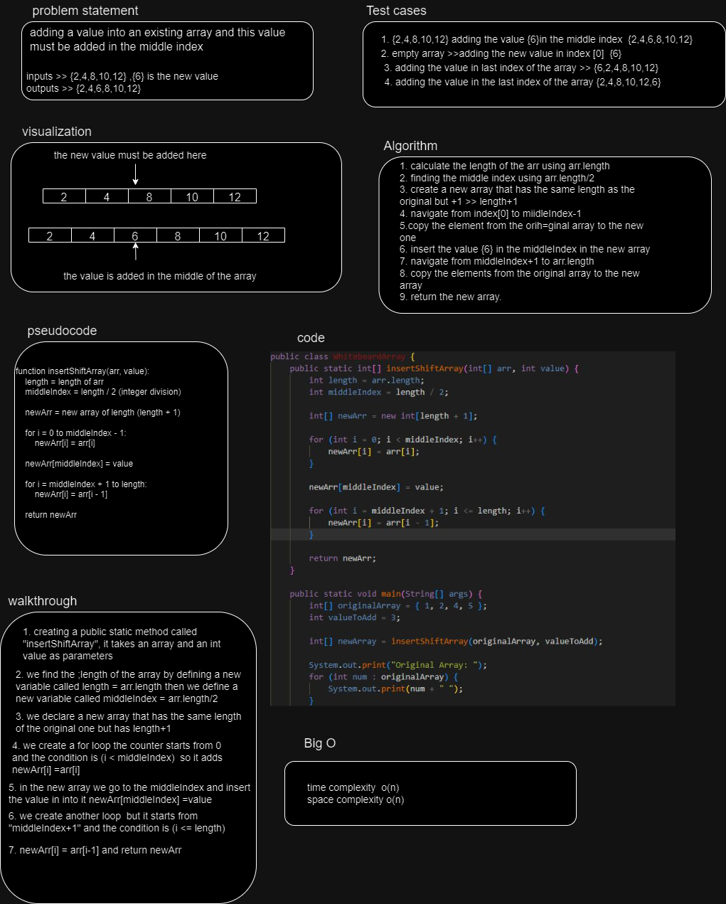

# data-structures-and-algorithms

## Code Challenge 02 

| Challenge   | Status     | description |
|-------------|------------| -------------|
| Challenge 2 | passed     | The challange was about creating a full white boeard this white board has the full explanation of the insert shift array to a value in the middle index of an array| 

