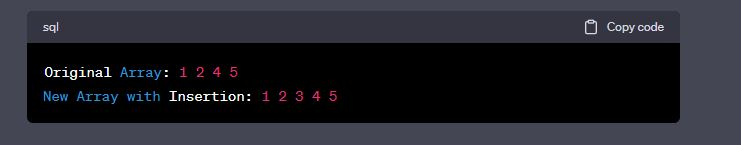

# data-structures-and-algorithms

# Challenge Title
 **Inser-shift-array**
 The challange was about creating a full white boeard this white board has the full explanation of the insert shift array to a value in the middle index of an array| 

## Whiteboard Process

## Approach & Efficiency

the Approach was passing insert and a value inside the method also creating 2 variables length to fond the array length and middle index to get to the middle index by length/2.
and creating for loop to go through the array and when the loop reaches the middle index to inert the value inside that index.
 **time** O(n)     **space** O(n)

## Solution

