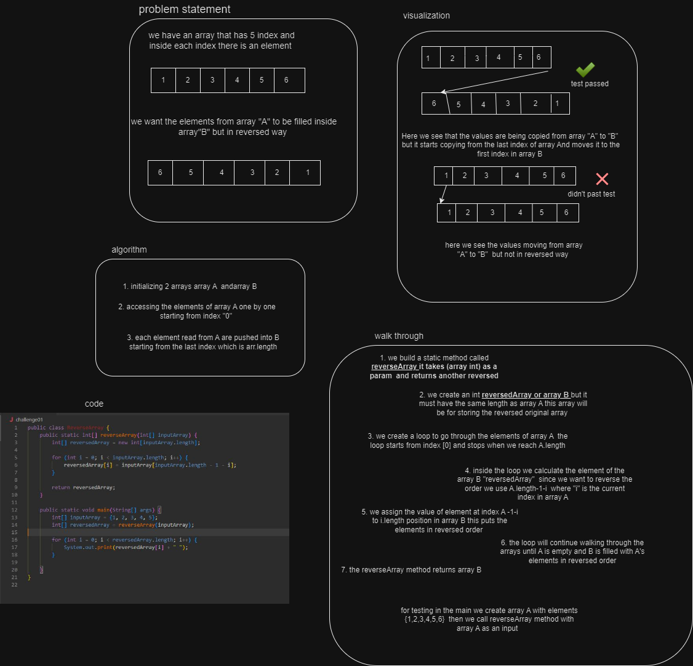

# data-structures-and-algorithms

## Code Challenge 01 

 
 
# Challenge Title
**Reverse array** 
The challange was about sending a whiteboard that explains the whole process of reversing an array and filling it into another array there wasa use of a tool to draw the whole thing "io.draw" and usage of loops and a method called reversed array the complixty was o(n) because we are working on an array an a loop going through the array without knowing how many index does this array have so the loop will work n of times, the features of tasks is introducing arrays and loops and theway to work with them also creating a method.

## Whiteboard Process

testing challange 01 

## Approach & Efficiency
for loop to go through the original array and another one to fill the other array but in reverse .
big O(n)

## Solution
     

