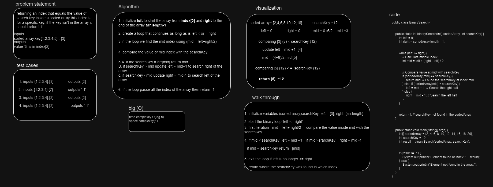
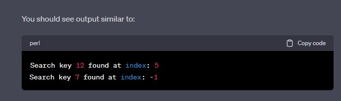

# data-structures-and-algorithms

# Challenge Title
 **BinarySearch**
The challenge was about checking if the value of searchKey = a value inside the array then return the index of value in the array and if it isn't inside the array return -1 

## Whiteboard Process

## Approach & Efficiency

the approach is about 
1. finding the middle index of the key by defining left and right the left is [0] and the ritgh is [arr.length]  we find the middle by adding left+right/2

2. comparing the value if searchKey in the middle if it equals the value of the middle then return the index of middle.

3. comparing the value if searchKey is > middleIndex value then we update the  left = mid +1 
if mid > searchKey then right = mid-1 

4. exit the loop when the left !<= right 
5. return the index of the search key and the search key value 
 **time** O(log n)     **space** O(1)

## Solution

