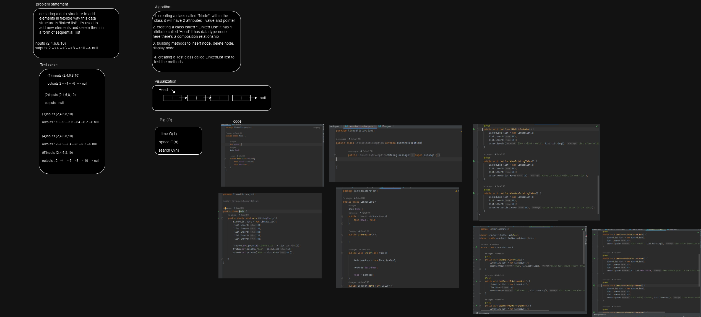
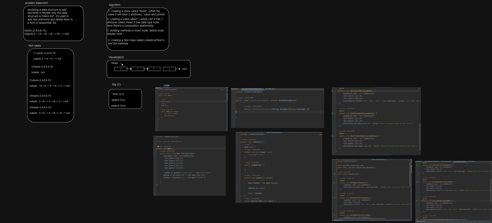
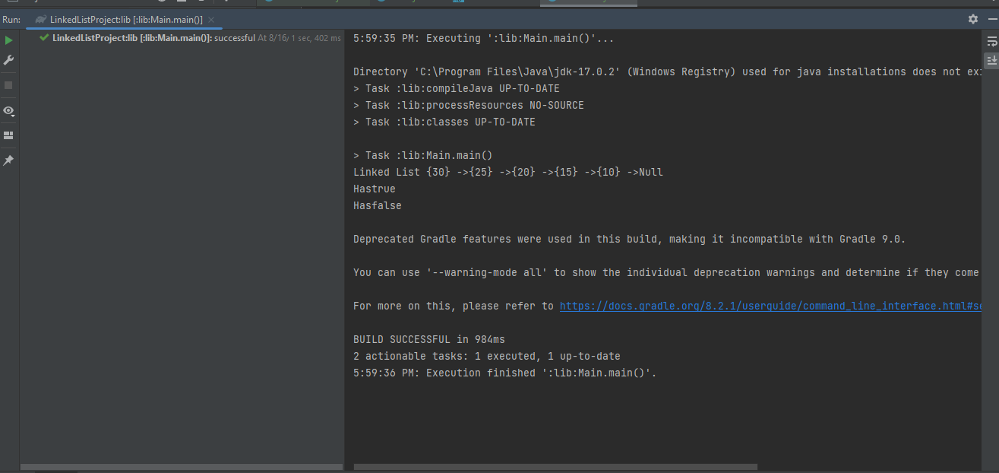

# Linked List 
the challenge i to create a linked list tha has **Node class** , **Linked List class** and **main class**
the code should help the user to insert into the list and look for value inside the list the test will enable the user 
to check where is the head and check the values inside the list.

## Whiteboard Process

## Approach & Efficiency
*Approach*
1. Single Responsibility Principle (SRP): The classes (LinkedList, Node) follow the SRP by having distinct responsibilities. LinkedList manages the linked list operations, and Node represents the individual elements.

2. Modularity and Encapsulation: The code is well-modularized with separate classes for the linked list and nodes, promoting encapsulation and maintainability.

3. Abstraction: The linked list class abstracts the complexity of managing nodes and provides a simple interface for insertion and searching.

4. Testing: The provided test cases cover essential functionality, ensuring that the core operations work as expected.

*Efficiency*
1. Insertion: the  current insertion operation has a time complexity of O(1) since it adds elements at the beginning of the linked list. This is an efficient approach.

2. Searching (Have): The Have method has a time complexity of O(n), where n is the number of elements in the linked list. It iterates through the list to find the specified value. This is acceptable for smaller lists, but for larger lists, consider using more advanced data structures like hash tables or balanced trees for faster searching.

Space Complexity: The space complexity of your linked list is O(n), where n is the number of elements. Each element consumes memory for the value and the reference to the next node

## Solution

