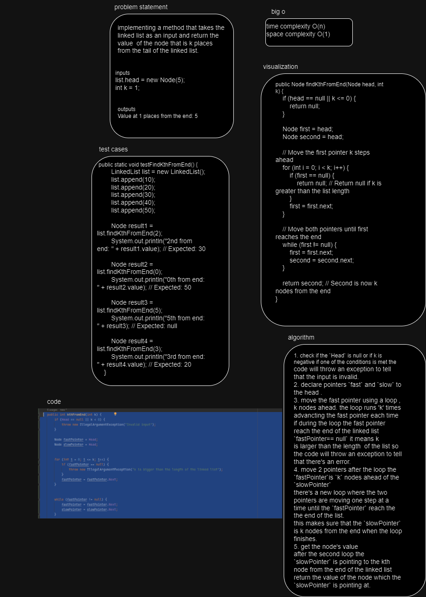
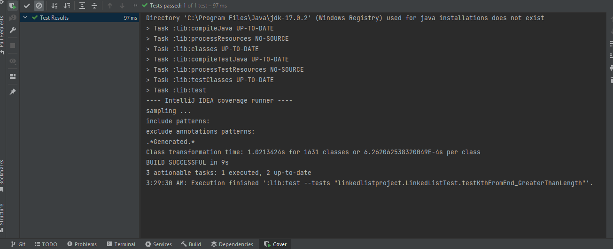
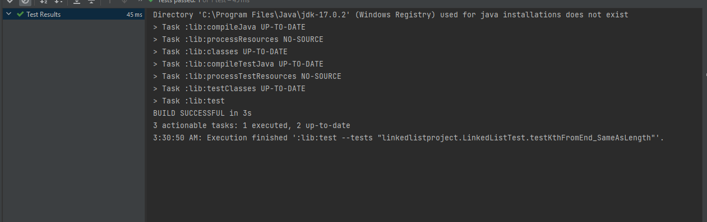
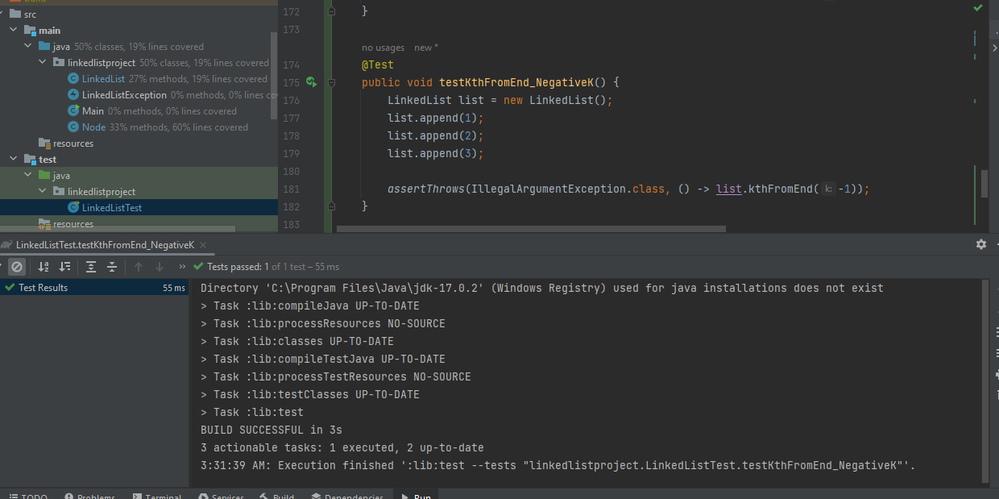
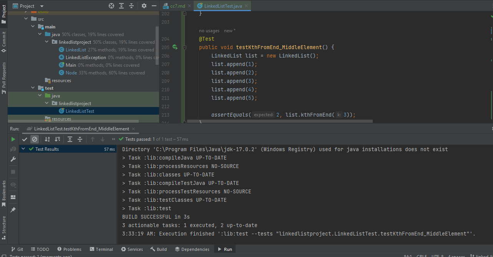

# linked-list-kth
the challenge asked for implementing a method for the linked list class which return a value of a node 
that is k places from the tail of the linked list 

## Whiteboard Process

## Approach & Efficiency
Approach 
1. check if the `Head` is null or if k is negative if one of the conditions is met the 
code will throw an exception to tell that the input is invalid.
2. declare pointers `fast` and `slow` to the head .
3. move the fast pointer using a loop , k nodes ahead. the loop runs 'k' times advancting the fast pointer each time
if during the loop the fast pointer reach the end of the linked list `fastPointer== null` it means k 
is larger than the length  of the list so the code will throw an exception to tell that there's an error.
4. move 2 pointers after the loop the `fastPointer`is `k` nodes ahead of the `slowPointer` 
there's a new loop where the two pointers are moving one step at a time until the `fastPointer` reach the the end of the list.
this makes sure that the `slowPointer` is k nodes from the end when the loop finishes.
5. get the node's value
after the second loop the `slowPointer` is pointing to the kth node from the end of the linked list return the value of the node which the `slowPointer` is pointing at.
 
efficiency 
time complexity O(n)
space complexity O(1)
## Solution

![img_6.png](img_6.png

