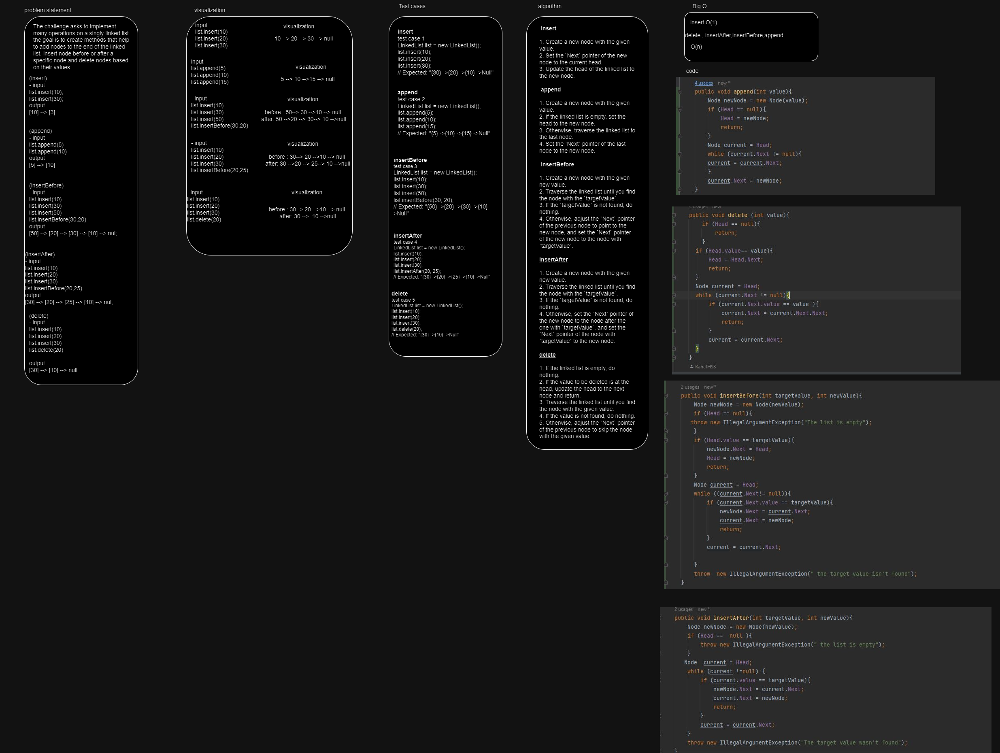

# Linked-list-insertion 
This challenge is about implementing many operations on a singly linked ist,
which has 
1. adding nodes to the end.
2. inserting nodes before or after a specific nodes
3. deleting nodes based on each value

## Whiteboard Process

## Approach & Efficiency
The approach for this challenge was to iteratively traverse the list while thinking of different scenarios
for each operation. The operations included (appending, inserting before a node, inserting after a node and deletinh nodes)

The big O for time depends on the specific operations. 
- insertion and deletion are o(n).
- appending is o(1) because it adds nodes at the end.

## Solution
To run the code there can be creation of linked list class and call the methods to perform operations.
such as 
1. list.insert 
2. list. append
3. list.insertAfter
4. ist.insertBefore
5. list. delete
6. System.out.println(list.toString())