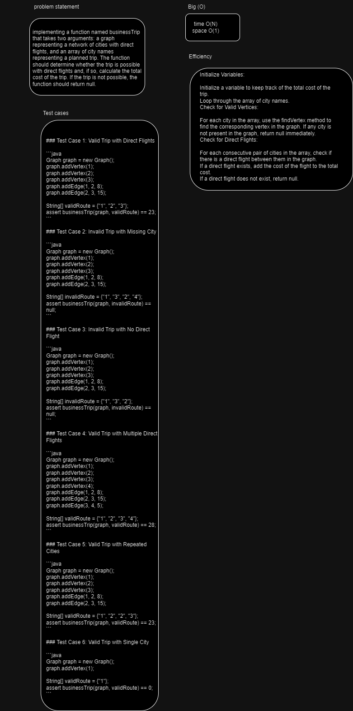
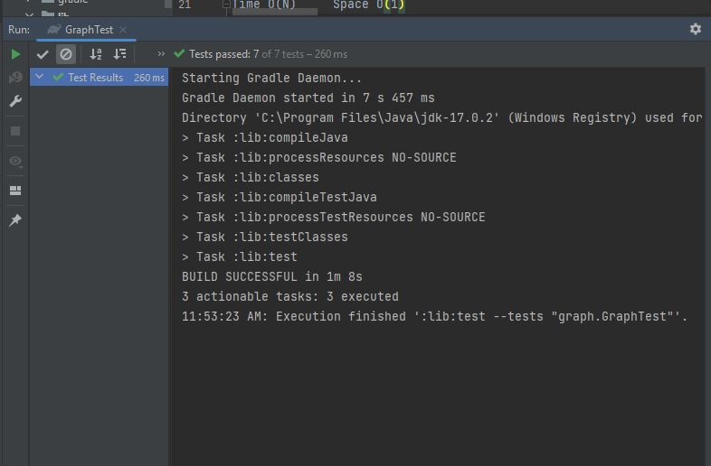

# Graph- Business - Trip
implementing a function named businessTrip that takes two arguments: a graph representing a network of cities with direct flights, and an array of city names representing a planned trip. The function should determine whether the trip is possible with direct flights and, if so, calculate the total cost of the trip. If the trip is not possible, the function should return null.
## Whiteboard Process

## Approach & Efficiency
Initialize Variables:

Initialize a variable to keep track of the total cost of the trip.
Loop through the array of city names.
Check for Valid Vertices:

For each city in the array, use the findVertex method to find the corresponding vertex in the graph. If any city is not present in the graph, return null immediately.
Check for Direct Flights:

For each consecutive pair of cities in the array, check if there is a direct flight between them in the graph.
If a direct flight exists, add the cost of the flight to the total cost.
If a direct flight does not exist, return null.

Time O(N)     Space O(1)
## Solution
