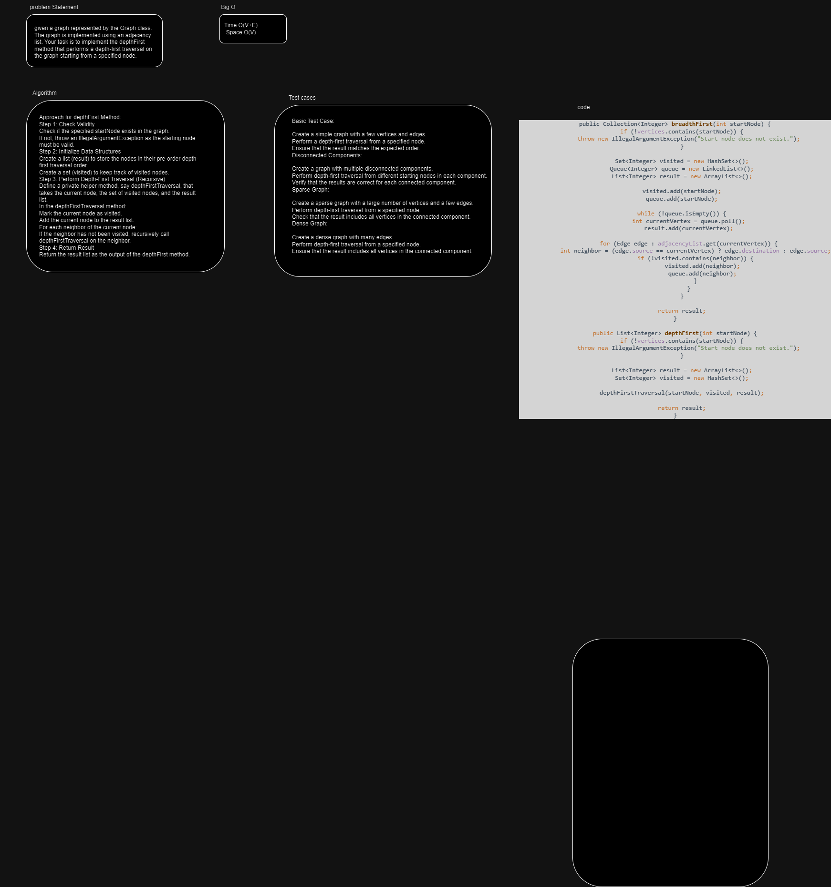
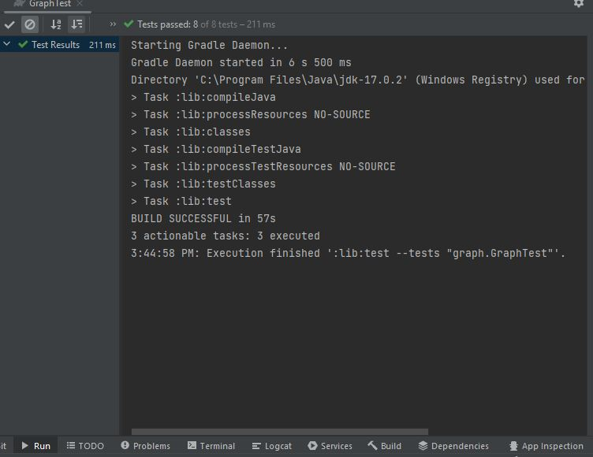

# graph-depth-first 
given a graph represented by the Graph class. The graph is implemented using an adjacency list. Your task is to implement the depthFirst method that performs a depth-first traversal on the graph starting from a specified node.

## Whiteboard Process

## Approach & Efficiency
Approach for depthFirst Method:
Step 1: Check Validity
Check if the specified startNode exists in the graph.
If not, throw an IllegalArgumentException as the starting node must be valid.
Step 2: Initialize Data Structures
Create a list (result) to store the nodes in their pre-order depth-first traversal order.
Create a set (visited) to keep track of visited nodes.
Step 3: Perform Depth-First Traversal (Recursive)
Define a private helper method, say depthFirstTraversal, that takes the current node, the set of visited nodes, and the result list.
In the depthFirstTraversal method:
Mark the current node as visited.
Add the current node to the result list.
For each neighbor of the current node:
If the neighbor has not been visited, recursively call depthFirstTraversal on the neighbor.
Step 4: Return Result
Return the result list as the output of the depthFirst method.

time O(V+E)   space O(V)
## Solution
