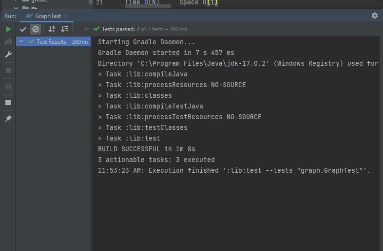

# Graph
implement your own graph class, representing the graph as an adjacency list. The class should include the following methods:

addVertex

Arguments: value
Returns: The added vertex
Description: Adds a vertex to the graph.
addEdge

Arguments: Two vertices to be connected by the edge, weight (optional)
Returns: Nothing
Description: Adds a new edge between two vertices in the graph. If specified, assign a weight to the edge. Both vertices should already be in the graph.
getVertices

Arguments: None
Returns: All vertices in the graph as a collection (set, list, or similar)
Description: Returns a collection of all vertices in the graph. An empty collection is returned if there are no vertices.
getNeighbors

Arguments: Vertex
Returns: A collection of edges connected to the given vertex, including the weight of the connection
Description: Returns a collection of edges connected to the specified vertex, including the weight of each connection. An empty collection is returned if there are no vertices.
size

Arguments: None
Returns: The total number of vertices in the graph
Description: Returns the total number of vertices in the graph. Returns 0 if there are no vertices.
## Whiteboard Process

## Approach & Efficiency
- Efficiency 
time --> O(1)     space --> O(E+V)
- Approach 

1. Class Edge:

Represents an edge in the graph.
Contains fields source, destination, and weight.
Has a constructor to initialize these fields.
2. Class Graph:

Uses an adjacency list to represent the graph.
Maintains a map (adjacencyList) where each vertex maps to a set of edges connected to it.
Uses a set (vertices) to keep track of all vertices in the graph.
3. addVertex Method:

Adds a vertex to the graph.
Initializes an empty set of edges for the new vertex in the adjacency list.
Returns the added vertex.
4. addEdge Method:

Adds an edge between two vertices in the graph.
Checks if both source and destination vertices exist in the graph.
Creates a new Edge object and adds it to the adjacency lists of both vertices.
5. removeVertex Method:

Removes a vertex from the graph.
Throws an exception if the vertex does not exist.
Removes the vertex from the set of vertices and the adjacency list.
Removes all edges connected to the vertex in the adjacency lists of other vertices.
6. removeEdge Method:

Removes an edge between two vertices.
Checks if both source and destination vertices exist in the graph.
Removes the edge from the adjacency lists of both vertices.
7. getVertices Method:

Returns a collection of all vertices in the graph.
8. getNeighbors Method:

Returns a collection of edges connected to a given vertex.
Uses getOrDefault to handle the case where the vertex has no neighbors.
9. size Method:

Returns the total number of vertices in the graph
## Solution

