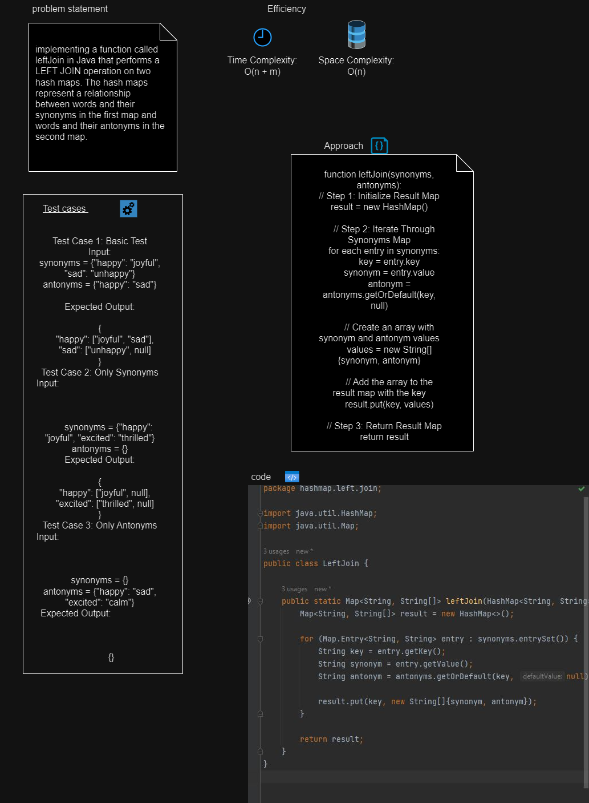
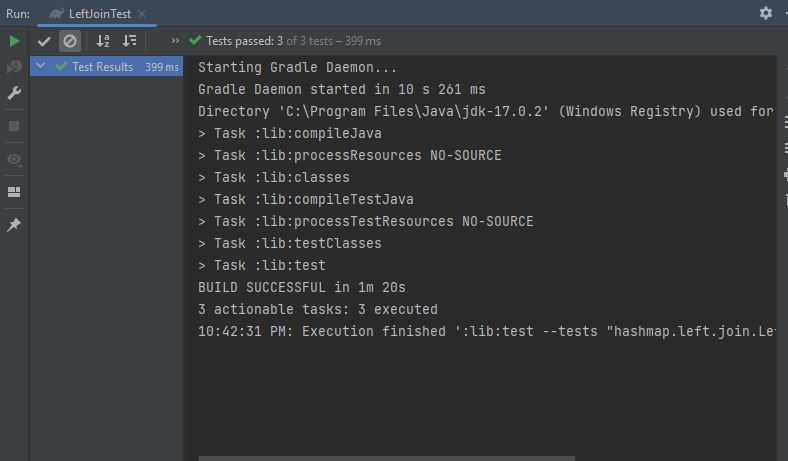

# Hashmap-Left-Join 
implementing a function called leftJoin in Java that performs a LEFT JOIN operation on two hash maps. The hash maps represent a relationship between words and their synonyms in the first map and words and their antonyms in the second map.
## Whiteboard Process

## Approach & Efficiency

(Approach )

function leftJoin(synonyms, antonyms):
// Step 1: Initialize Result Map
result = new HashMap()

    // Step 2: Iterate Through Synonyms Map
    for each entry in synonyms:
        key = entry.key
        synonym = entry.value
        antonym = antonyms.getOrDefault(key, null)
        
        // Create an array with synonym and antonym values
        values = new String[]{synonym, antonym}

        // Add the array to the result map with the key
        result.put(key, values)

    // Step 3: Return Result Map
    return result

(Efficiency)
Time Complexity:
O(n + m)

Space Complexity:
O(n)
## Solution

