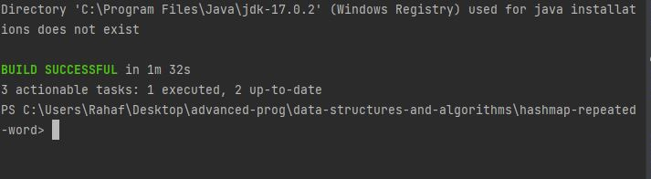

#  hashmap-repeated-word
write a function called repeatedWord that finds the first word to occur more than once in a string. The function should take a string as an argument and return the first repeated word as a string
## Whiteboard Process
[31.md](31.md)
## Approach & Efficiency

# Approach 

Check for Edge Cases:

Before processing the input string, check for edge cases. Specifically, check if the input string is null or empty. If it is, return null as there is no word to check.
Tokenize the Input String:

Tokenize the input string into words. You can split the string using regular expressions to handle common punctuation and whitespace characters. In the example code provided earlier, split("[\\s,.!?;:()\\[\\]{}]+") was used to tokenize the input string.
Use a HashSet to Track Words:

Create a HashSet to keep track of the words you've seen. A HashSet is a data structure that ensures all elements are unique. You'll add each word to the HashSet as you encounter it.
Check for Repeated Words:

For each word in the tokenized array, check if it's already in the HashSet. If it is, return that word as it's the first repeated word found.
Return Result:

If no repeated word is found after processing all the words, return null.

# Efficiency
(time )
In the best case (no repeated words), the function will scan all words once, resulting in O(n) time complexity.
In the worst case (the first repeated word is at the end of the string), the function will scan all words and add them to the HashSet, taking O(n) tim

(space)
The space complexity primarily depends on the number of unique words in the input string. In the worst case, where all words are unique, the space complexity is O(n).

## Solution

