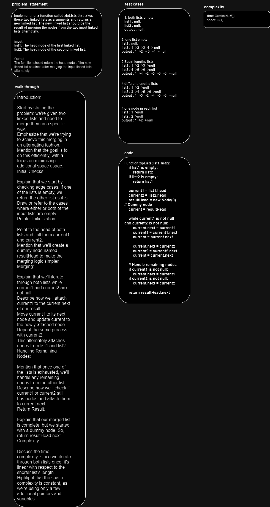

# linked-list-zip

implementing a function called zipLists that takes these two linked lists as arguments and returns a new linked list. 
The new linked list should be the result of merging the nodes from the two input linked lists alternately.

## Whiteboard Process

## Approach & Efficiency
# Approach for zipLists

1. Check for edge cases:
- If list1 is empty, return list2.
- If list2 is empty, return list1.

2. Initialize pointers current1 and current2 to the heads of list1 and list2 respectively.

3. Create a dummy node resultHead to serve as the head of the merged list. Initialize a current pointer to the resultHead.

4. Iterate while both current1 and current2 are not null:

- Attach current1 to current.next.
- Move current1 to its next node. 
- Move current to the new current node (which is now current1's previous node).
- Attach current2 to current.next.
- Move current2 to its next node.
- Move current to the new current node (which is now current2's previous node).

5. Handle remaining nodes

- If there are remaining nodes in list1, attach them to current.next.
- If there are remaining nodes in list2, attach them to current.next.

6. Return the merged list, starting from resultHead.next.

# Approach for mergeSortedLists

1. Check for edge cases

- If list1 is empty, return list2.
- If list2 is empty, return list1.

2. Initialize pointers current1 and current2 to the heads of list1 and list2 respectively.

3. Create a dummy node mergedHead to serve as the head of the merged sorted list. Initialize a current pointer to the mergedHead.

4. Iterate while both current1 and current2 are not null:

- Compare the values of current1 and current2.
- Attach the smaller node to current.next.
- Move the pointer of the smaller node (current1 or current2) to its next node.
- Move current to the new current node (which is now the smaller node's previous node).

5. Handle remaining nodes

- If there are remaining nodes in list1, attach them to current.next.
- If there are remaining nodes in list2, attach them to current.next.

6. Return the merged sorted list, starting from mergedHead.next.

# Efficiency of zipLists:
- Time Complexity: The time complexity of this approach is O(min(N, M)), where N is the length of list1 and M is the length of list2. We iterate through both lists simultaneously, stopping when one of them reaches the end. Since we iterate through the lists once and perform constant time operations for each node, the time complexity is linear with respect to the length of the shorter list.

- Space Complexity: The space complexity is O(1) since we only use a constant amount of additional space for variables (pointers and temporary nodes), regardless of the input sizes.

# Efficiency of mergeSortedLists:
- Time Complexity: The time complexity of this approach is O(N + M), where N is the length of list1 and M is the length of list2. We iterate through both lists once, comparing and merging the nodes. Again, since we iterate through the lists linearly and perform constant time operations for each node, the time complexity is linear with respect to the total number of nodes in both lists.

- Space Complexity: The space complexity is O(1) since we only use a constant amount of additional space for variables (pointers and temporary nodes), regardless of the input sizes.

## Solution
