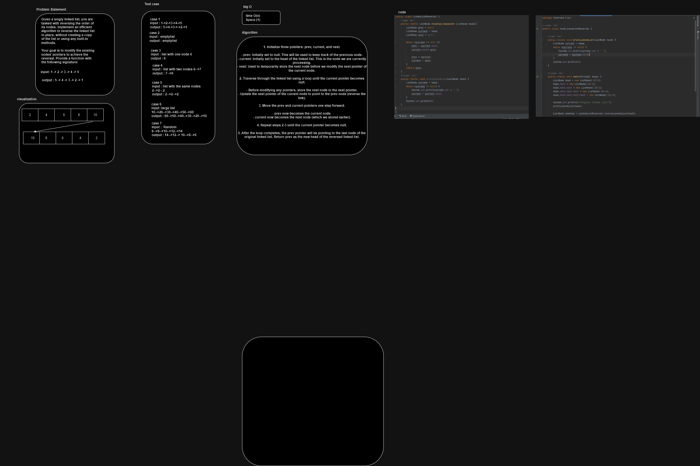
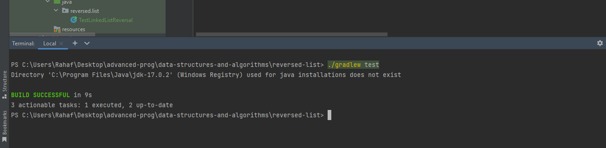

# LinkedListReversal 

 given a singly linked list, where each node contains an integer value and a reference to the next node in the list. Your task is to implement a function reverseLinkedList that reverses the order of the nodes in the linked list.

You need to provide an in-place solution, which means you should avoid creating a copy of the linked list or using any built-in methods available in your language. Your goal is to modify the pointers of the existing nodes to reverse the list.

# Approach and efficiency 

1. Initialize three pointers: prev, current, and next.

- prev: Initially set to null. This will be used to keep track of the previous node.
- current: Initially set to the head of the linked list. This is the node we are currently processing.
- next: Used to temporarily store the next node before we modify the next pointer of the current node.

2. Traverse through the linked list using a loop until the current pointer becomes null.

- Before modifying any pointers, store the next node in the next pointer.
- Update the next pointer of the current node to point to the prev node (reverse the link).

3. Move the prev and current pointers one step forward.

- prev now becomes the current node.
- current now becomes the next node (which we stored earlier).

4. Repeat steps 2-3 until the current pointer becomes null.

5. After the loop completes, the prev pointer will be pointing to the last node of the original linked list. Return prev as the new head of the reversed linked list.

time complexity: O(n)
space complexity : O(1)

# pseudo code 

      function reverseLinkedList(head):
      prev = null            // Initialize the previous node as null
      current = head         // Start processing from the head node

    while current is not null:
        next = current.next  // Store the next node
        
        // Reverse the current node's next pointer
        current.next = prev
        
        prev = current       // Move prev and current one step forward
        current = next
        
    return prev  // New head of the reversed linked list

# whiteboard 

# Testing 

