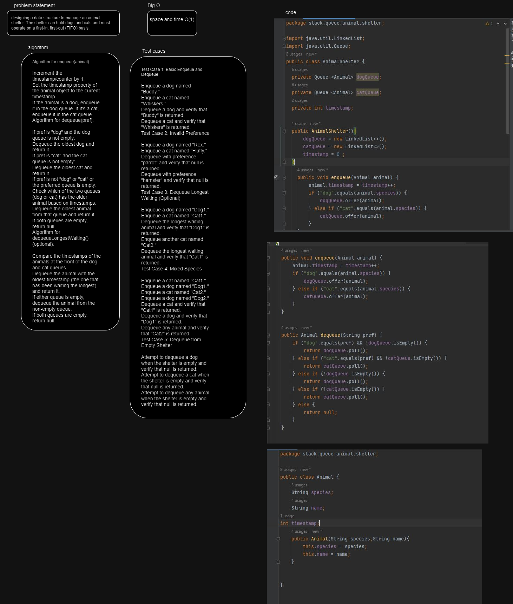
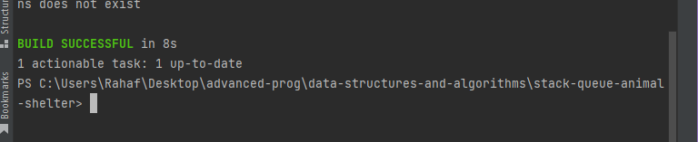

# stack.queue.animal.shelter
The challenge involves creating two Java classes: Animal and AnimalShelter.

1. Animal class:

Contains properties for species, name, and a timestamp.
Represents individual animals in the shelter.
2. AnimalShelter class:

Manages queues of dogs and cats using FIFO.
Provides methods to enqueue animals based on species and dequeue animals based on species preferences.
As a stretch goal, returns the animal that has been in the shelter the longest when no specific preference is given.

## Whiteboard Process

## Approach & Efficiency
1. Implement the Animal class:

Create a class called Animal with properties for species, name, and timestamp.
Provide a constructor to initialize these properties.
Ensure the timestamp field can be set when an animal is created.
2. Implement the AnimalShelter class:

Create a class called AnimalShelter.
Declare two queues, one for dogs and one for cats.
Include a timestamp variable to track when animals are added.
Implement a constructor to initialize the queues and timestamp.
3. Implement the enqueue method:

In the AnimalShelter class, create an enqueue method that takes an Animal object as an argument.
Determine the species of the animal and add it to the appropriate queue (dog or cat).
Update the timestamp for the added animal.
4. Implement the dequeue method:

Create a dequeue method in the AnimalShelter class that takes a pref (preference) parameter, which can be "dog" or "cat."
Check the preference and dequeue the oldest animal of that species from the respective queue.
Return the dequeued animal, or null if there are no animals of the specified species in the shelter.
5. Implement the stretch goal (optional):

To handle cases where neither "dog" nor "cat" is preferred, add logic to return the animal that has been waiting in the shelter the longest. You can compare the timestamps to achieve this.

time and space complexity O(1)

## Solution

