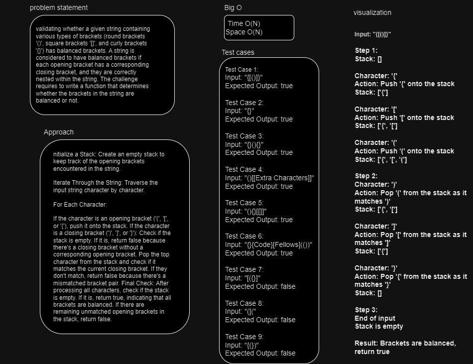

# stack-queue-brackets
validating whether a given string containing various types of brackets (round brackets '()', square brackets '[]', and curly brackets '{}') has balanced brackets. A string is considered to have balanced brackets if each opening bracket has a corresponding closing bracket, and they are correctly nested within the string. The challenge requires to write a function that determines whether the brackets in the string are balanced or not.

## Whiteboard Process

## Approach & Efficiency

(Approach) 
Initialize a Stack: Create an empty stack to keep track of the opening brackets encountered in the string.

Iterate Through the String: Traverse the input string character by character.

For Each Character:

If the character is an opening bracket ('(', '[', or '{'), push it onto the stack.
If the character is a closing bracket (')', ']', or '}'):
Check if the stack is empty. If it is, return false because there's a closing bracket without a corresponding opening bracket.
Pop the top character from the stack and check if it matches the current closing bracket. If they don't match, return false because there's a mismatched bracket pair.
Final Check: After processing all characters, check if the stack is empty. If it is, return true, indicating that all brackets are balanced. If there are remaining unmatched opening brackets in the stack, return false.

(Efficiency)
Time complexity O(N)
space complexity O(N)

## Solution
!~~[cc13 testing.JPG](cc13%20testing.JPG)