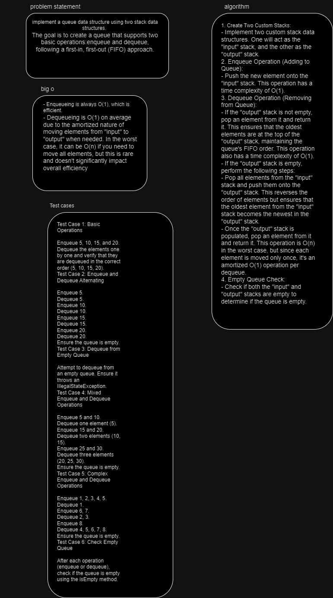
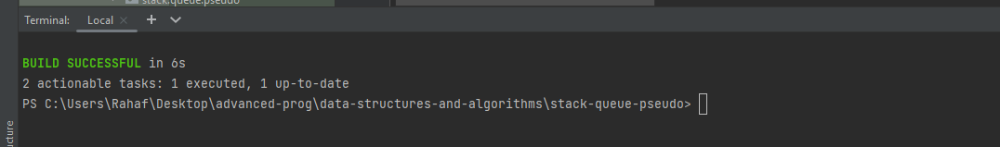

# PseudoQueue
implement a queue data structure using two stack data structures. 
The goal is to create a queue that supports two basic operations:enqueue and dequeue, following a first-in, first-out (FIFO) approach.

## Whiteboard Process

## Approach & Efficiency
1. Create Two Custom Stacks:
- Implement two custom stack data structures. One will act as the "input" stack, and the other as the "output" stack.
2. Enqueue Operation (Adding to Queue):
- Push the new element onto the "input" stack. This operation has a time complexity of O(1).
3. Dequeue Operation (Removing from Queue):
- If the "output" stack is not empty, pop an element from it and return it. This ensures that the oldest elements are at the top of the "output" stack, maintaining the queue's FIFO order. This operation also has a time complexity of O(1).
- If the "output" stack is empty, perform the following steps:
- Pop all elements from the "input" stack and push them onto the "output" stack. This reverses the order of elements but ensures that the oldest element from the "input" stack becomes the newest in the "output" stack.
- Once the "output" stack is populated, pop an element from it and return it. This operation is O(n) in the worst case, but since each element is moved only once, it's an amortized O(1) operation per dequeue.
4. Empty Queue Check:
- Check if both the "input" and "output" stacks are empty to determine if the queue is empty.

## efficiency of this approach for implementing a queue using two stacks is generally quite good:

- Enqueueing is always O(1), which is efficient.
- Dequeueing is O(1) on average due to the amortized nature of moving elements from "input" to "output" when needed. In the worst case, it can be O(n) if you need to move all elements, but this is rare and doesn't significantly impact overall efficiency
## Solution

