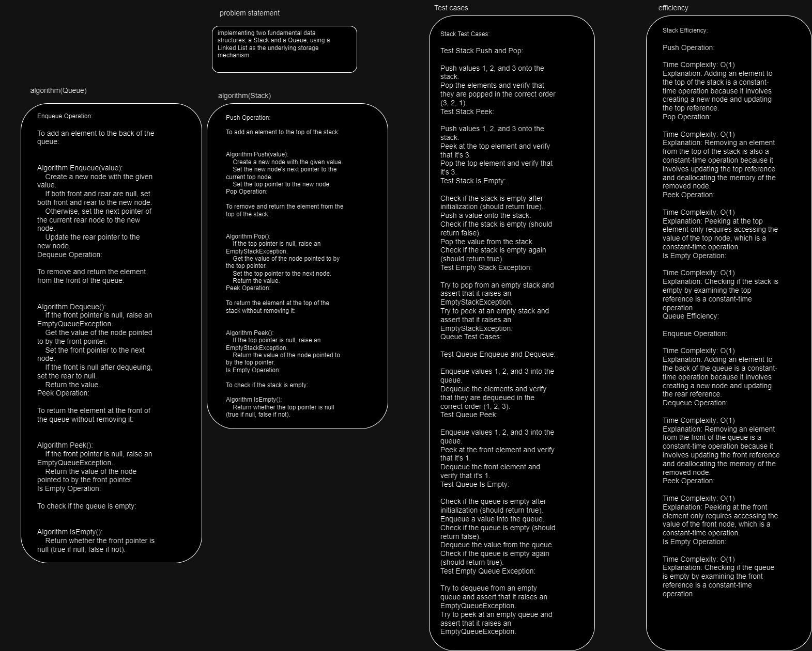
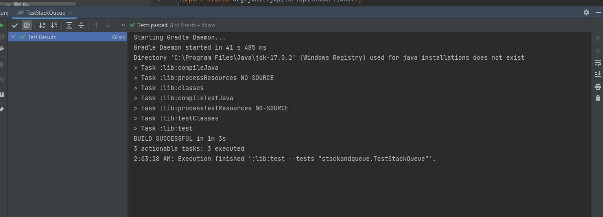
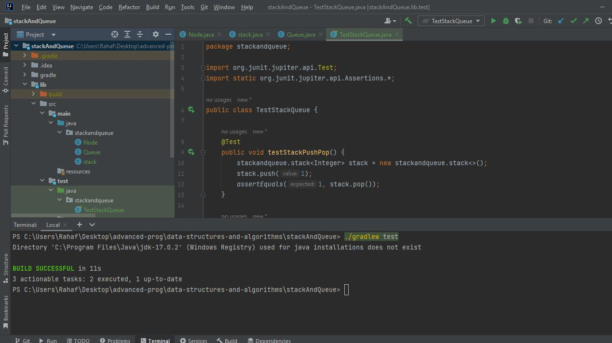

# Stack and queue 
implementing a Stack and Queue data structure using a Linked List as the underlying data storage mechanism.

## Whiteboard Process

## Approach & Efficiency
## Approach 
1. Create a Node Class:

Implement a Node class with properties for the value stored in the node and a reference (next) to the next node in the list.
2. Implement the Stack Class:

Create a stack class with a top property that initially points to null when the stack is created.

Implement the push(value) method:

Create a new node with the given value.
Set the next pointer of the new node to point to the current top.
Update the top to point to the new node.
Implement the pop() method:

Check if the stack is empty (i.e., top is null).
If empty, throw an EmptyStackException.
Otherwise, retrieve the value from the top node, update top to point to the next node, and return the retrieved value.
Implement the peek() method:

Check if the stack is empty (i.e., top is null).
If empty, throw an EmptyStackException.
Otherwise, return the value of the node at the top of the stack without removing it.
Implement the isEmpty() method:

Check if top is null. If it is, return true; otherwise, return false.
3. Implement the Queue Class:

Create a Queue class with front and rear properties initially set to null.

Implement the enqueue(value) method:

Create a new node with the given value.
If the queue is empty (both front and rear are null), set both front and rear to the new node.
Otherwise, update the next pointer of the current rear node to point to the new node and update rear to the new node.
Implement the dequeue() method:

Check if the queue is empty (i.e., front is null).
If empty, throw an EmptyQueueException.
Otherwise, retrieve the value from the front node, update front to point to the next node, and return the retrieved value.
Implement the peek() method:

Check if the queue is empty (i.e., front is null).
If empty, throw an EmptyQueueException.
Otherwise, return the value of the node at the front of the queue without removing it.
Implement the isEmpty() method:

Check if front is null. If it is, return true; otherwise, return false.

## Efficiency 
1. Stack Efficiency:

push(value):

Time Complexity: O(1)
Explanation: Adding an element to the top of the stack involves creating a new node and updating the top reference. Since these operations are constant time, the time complexity is O(1).
pop():

Time Complexity: O(1)
Explanation: Removing an element from the top of the stack also involves updating the top reference and deallocating the memory of the removed node. These operations are constant time, so the time complexity is O(1).
peek():

Time Complexity: O(1)
Explanation: Peeking at the top element only requires accessing the value of the top node, which is a constant-time operation.
isEmpty():

Time Complexity: O(1)
Explanation: Checking if the stack is empty by examining the top reference is a constant-time operation.
Space Complexity:

The space complexity of the stack is O(n), where n is the number of elements in the stack. Each element in the stack corresponds to a node in the linked list, so the space complexity is linear with respect to the number of elements.
2. Queue Efficiency:

enqueue(value):

Time Complexity: O(1)
Explanation: Adding an element to the back of the queue involves creating a new node and updating the rear reference. These operations are constant time, so the time complexity is O(1).
dequeue():

Time Complexity: O(1)
Explanation: Removing an element from the front of the queue involves updating the front reference and deallocating the memory of the removed node. These operations are constant time, so the time complexity is O(1).
peek():

Time Complexity: O(1)
Explanation: Peeking at the front element only requires accessing the value of the front node, which is a constant-time operation.
isEmpty():

Time Complexity: O(1)
Explanation: Checking if the queue is empty by examining the front reference is a constant-time operation.
Space Complexity:

The space complexity of the queue is O(n), where n is the number of elements in the queue. Each element in the queue corresponds to a node in the linked list, so the space complexity is linear with respect to the number of elements.

## Solution

