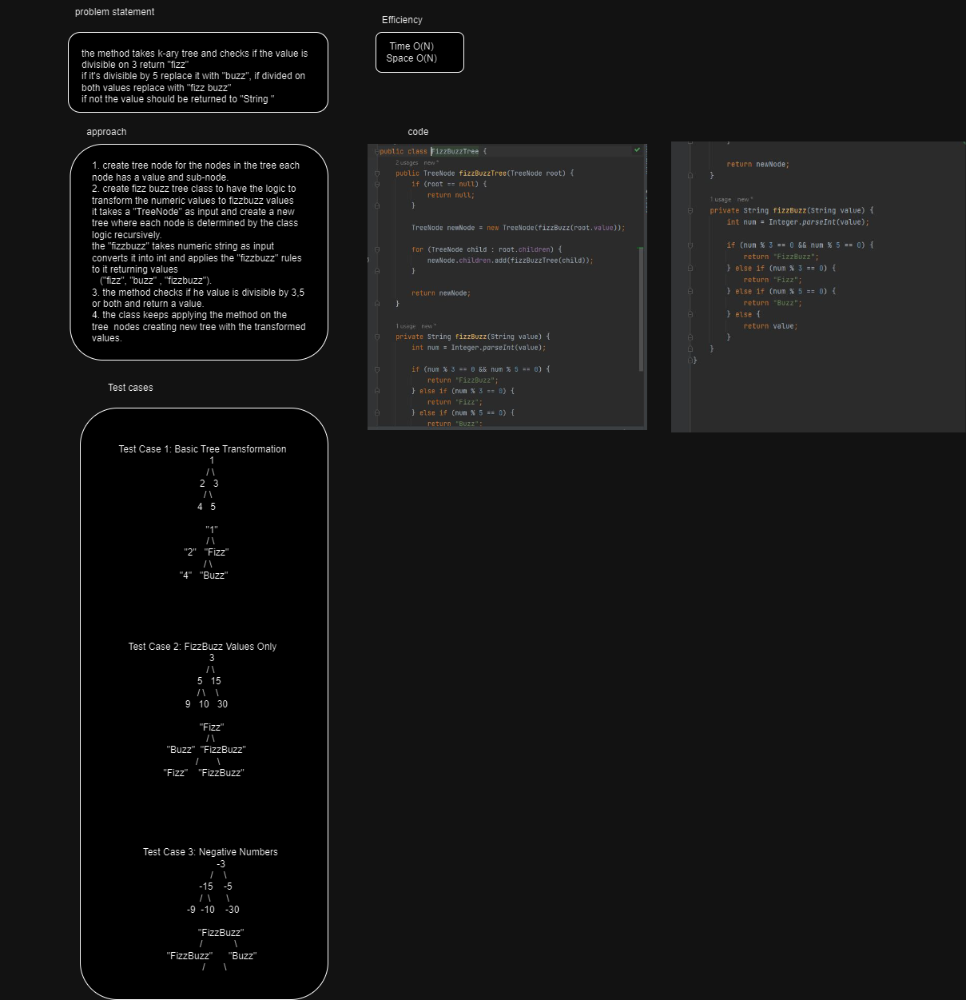
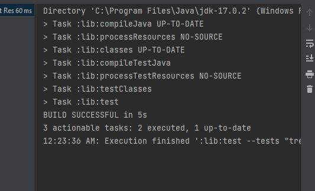
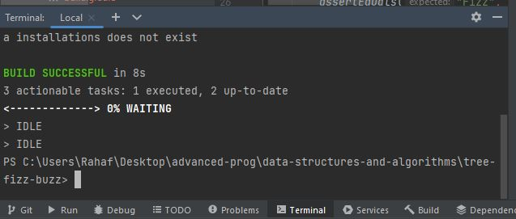

# fizz buzz tree
the method takes k-ary tree and checks if the value is divisible on 3 return "fizz"
if it's divisible by 5 replace it with "buzz", if divided on both values repace with "fizz buzz"
if not the value should be returned to "String "

## Whiteboard Process

## Approach & Efficiency

1. create tree node for the nodes in the tree each node has a value and sub-node.
2. create fizz buzz tree class to have the logic to transform the numeric values to fizzbuzz values 
it takes a "TreeNode" as input and create a new tree where each node is determined by the class logic recursively.
the "fizzbuzz" takes numeric string as input converts it into int and applies the "fizzbuzz" rules to it returning values
   ("fizz", "buzz" , "fizzbuzz").
3. the method checks if he value is divisible by 3,5 or both and return a value.
4. the class keeps applying the method on the tree  nodes creating new tree with the transformed values.

time O(N)
space O(N)
## Solution

