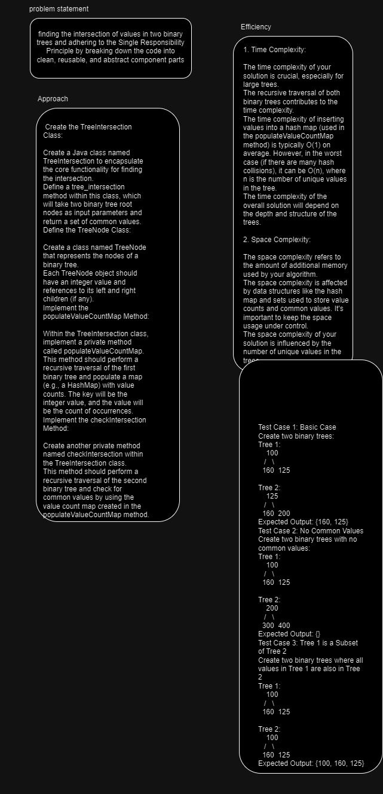
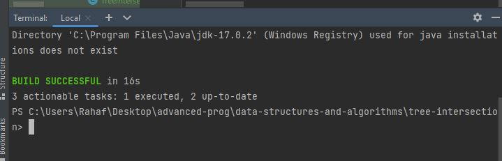

# Tree Intersection
finding the intersection of values in two binary trees and adhering to the Single Responsibility Principle by breaking down the code into clean, reusable, and abstract component parts
## Whiteboard Process

## Approach & Efficiency
- (Approach)
  Create the TreeIntersection Class:

Create a Java class named TreeIntersection to encapsulate the core functionality for finding the intersection.
Define a tree_intersection method within this class, which will take two binary tree root nodes as input parameters and return a set of common values.
Define the TreeNode Class:

Create a class named TreeNode that represents the nodes of a binary tree.
Each TreeNode object should have an integer value and references to its left and right children (if any).
Implement the populateValueCountMap Method:

Within the TreeIntersection class, implement a private method called populateValueCountMap.
This method should perform a recursive traversal of the first binary tree and populate a map (e.g., a HashMap) with value counts. The key will be the integer value, and the value will be the count of occurrences.
Implement the checkIntersection Method:

Create another private method named checkIntersection within the TreeIntersection class.
This method should perform a recursive traversal of the second binary tree and check for common values by using the value count map created in the populateValueCountMap method.

- (Efficiency)

1. Time Complexity:

The time complexity of your solution is crucial, especially for large trees.
The recursive traversal of both binary trees contributes to the time complexity.
The time complexity of inserting values into a hash map (used in the populateValueCountMap method) is typically O(1) on average. However, in the worst case (if there are many hash collisions), it can be O(n), where n is the number of unique values in the tree.
The time complexity of the overall solution will depend on the depth and structure of the trees.

2. Space Complexity:

The space complexity refers to the amount of additional memory used by your algorithm.
The space complexity is affected by data structures like the hash map and sets used to store value counts and common values. It's important to keep the space usage under control.
The space complexity of your solution is influenced by the number of unique values in the trees.

## Solution
