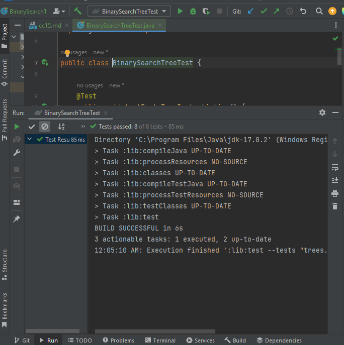

# Trees 
design, implement, and test a binary tree and a binary search tree (BST) in Java.

## Whiteboard Process
<!-- Embedded whiteboard image -->

## Approach & Efficiency

# Efficiency 
### Binary Trees:

Time Complexity:

Traversals (pre-order, in-order, post-order): O(n) in the worst case, where n is the number of nodes.
Searching for a specific value: O(n) in the worst case.
Insertion and deletion: O(1) when you have a reference to the node; otherwise, O(n).
Space Complexity: O(n) for storing the tree structure and the recursive function call stack during traversals.

### Binary Search Trees (BSTs):

Time Complexity:

Searching for a specific value: O(h), where h is the height of the tree. In a balanced BST, it's O(log n), while in the worst case (unbalanced), it's O(n).
Insertion and deletion: O(h) for the same reasons as searching.
Space Complexity: O(n) for storing the tree structure.

# Approach
## Binary Trees:

Node Class: Create a Node class to represent individual nodes in the tree, each containing a value and references to left and right children.

BinaryTree Class: Create a BinaryTree class to represent the binary tree itself. Implement methods for pre-order, in-order, and post-order traversals.

Efficiency: Binary trees have a time complexity of O(n) for traversals and searching in the worst case. Insertion and deletion are O(1) if you have a reference to the node; otherwise, they can be O(n).

Balancing: Binary trees do not self-balance, so they can become unbalanced, leading to inefficient search times in some cases.

## Binary Search Trees 
Node Class: Similar to binary trees, create a Node class with value and left/right child references.

BinarySearchTree Class: Create a BinarySearchTree class as a subclass of BinaryTree. Implement methods to add values while maintaining the BST property and to check if a value exists in the tree.

Efficiency: BSTs have a time complexity of O(log n) for searching, insertion, and deletion in balanced cases. In the worst case (unbalanced), they can have a time complexity of O(n).

Balancing: Balanced BSTs (e.g., AVL trees, Red-Black trees) automatically maintain balance during insertions and deletions, ensuring efficient search times.

Memory Usage: Both binary trees and BSTs have a space complexity of O(n) to store the tree structure.
## Solution

