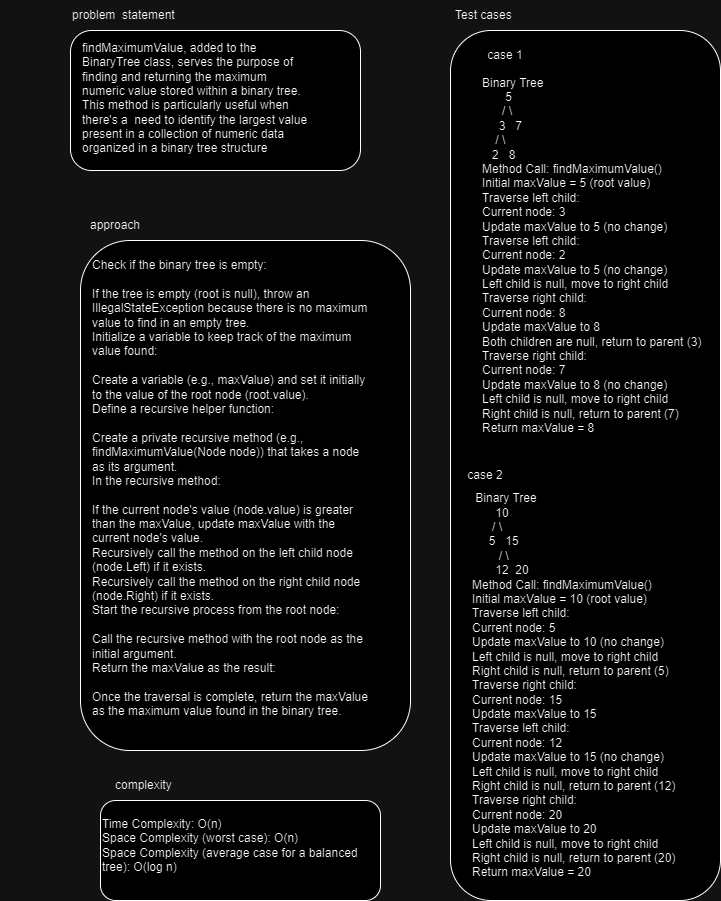

## Maximum Value in a Binary Tree
findMaximumValue, added to the BinaryTree class, serves the purpose of finding and returning the maximum numeric value stored within a binary tree. 
This method is particularly useful when there's a  need to identify the largest value present in a collection of numeric data organized in a binary tree structure

## Whiteboard Process

## Approach & Efficiency
Check if the binary tree is empty:

If the tree is empty (root is null), throw an IllegalStateException because there is no maximum value to find in an empty tree.
Initialize a variable to keep track of the maximum value found:

Create a variable (e.g., maxValue) and set it initially to the value of the root node (root.value).
Define a recursive helper function:

Create a private recursive method (e.g., findMaximumValue(Node node)) that takes a node as its argument.
In the recursive method:

If the current node's value (node.value) is greater than the maxValue, update maxValue with the current node's value.
Recursively call the method on the left child node (node.Left) if it exists.
Recursively call the method on the right child node (node.Right) if it exists.
Start the recursive process from the root node:

Call the recursive method with the root node as the initial argument.
Return the maxValue as the result:

Once the traversal is complete, return the maxValue as the maximum value found in the binary tree.

Time Complexity: O(n)
Space Complexity (worst case): O(n)
Space Complexity (average case for a balanced tree): O(log n)
## Solution

