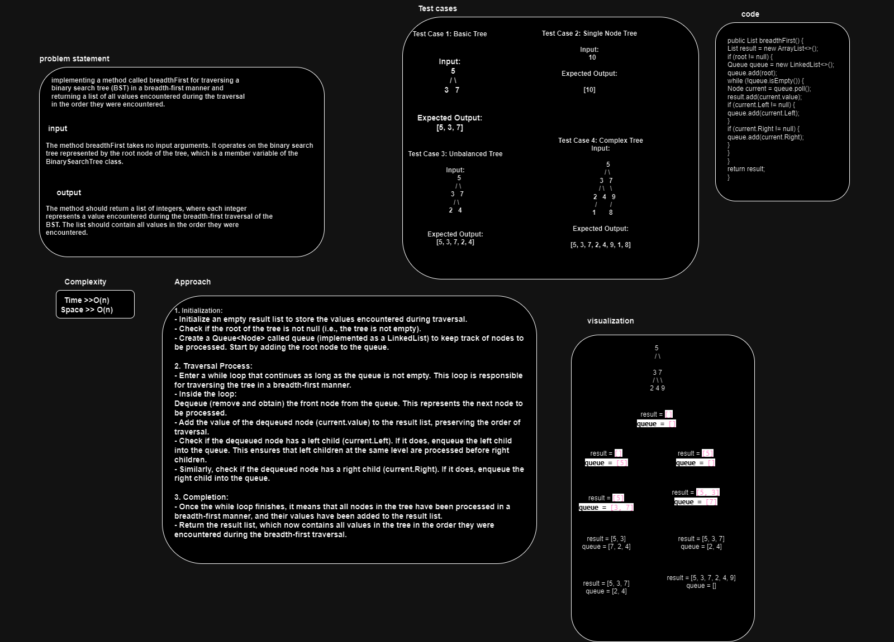

# Breadth-first Traversal.
The challenge is to efficiently manage the queue, handle the enqueue and dequeue operations, and accurately record the values encountered during the traversal while adhering to the breadth-first approach.

## Whiteboard Process

## Approach & Efficiency
1. Initialization:
- Initialize an empty result list to store the values encountered during traversal.
- Check if the root of the tree is not null (i.e., the tree is not empty).
- Create a Queue<Node> called queue (implemented as a LinkedList) to keep track of nodes to be processed. Start by adding the root node to the queue.

2. Traversal Process:
- Enter a while loop that continues as long as the queue is not empty. This loop is responsible for traversing the tree in a breadth-first manner.
- Inside the loop:
Dequeue (remove and obtain) the front node from the queue. This represents the next node to be processed.
- Add the value of the dequeued node (current.value) to the result list, preserving the order of traversal.
- Check if the dequeued node has a left child (current.Left). If it does, enqueue the left child into the queue. This ensures that left children at the same level are processed before right children.
- Similarly, check if the dequeued node has a right child (current.Right). If it does, enqueue the right child into the queue.

3. Completion:
- Once the while loop finishes, it means that all nodes in the tree have been processed in a breadth-first manner, and their values have been added to the result list.
- Return the result list, which now contains all values in the tree in the order they were encountered during the breadth-first traversal.

## Efficiency 
*time*   O(n)
*space*  O(n)
## Solution

